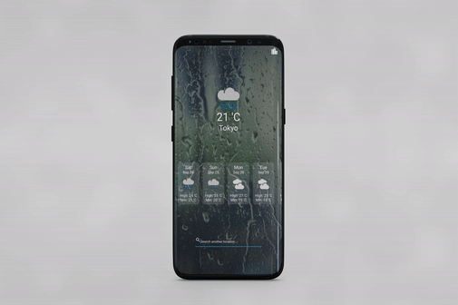

#  Flutter Weather App
Flutter app created using Weather Api.

## Table of contents
* [Prerequisites](#prerequisites)
* [Technologies](#technologies)
* [Features](#features)
* [UI](#ui)
* [Resources](#Resources)
* [Contact](#contact)

## Prerequisites
- Text Editor ([VS Code](https://code.visualstudio.com/download) , [Android Studio](https://developer.android.com/studio)
- Flutter - [install here](https://flutter.dev/docs/get-started/install)

## Technologies
Project is created with:
* Meta Weather API [API Link](https://www.metaweather.com/api/)

## Features
List of features ready and TODOs for future development
* Display present day Weather details based on the location.
* Gives seven day weather forcast based on the location.
* Search City's
* GeoLocator, provides current user location based on GPS.

To-do list:
* Add current day weather report at different time.

## UI

## Resources

A few resources to get you started if this is your first Flutter project:

- [Lab: Write your first Flutter app](https://flutter.dev/docs/get-started/codelab)
- [Cookbook: Useful Flutter samples](https://flutter.dev/docs/cookbook)

For help getting started with Flutter, view our
[online documentation](https://flutter.dev/docs), which offers tutorials,
samples, guidance on mobile development, and a full API reference.

## Contact
[Suhas Suhas](https://www.suhassalian.netlify.com/) - feel free to contact me!

